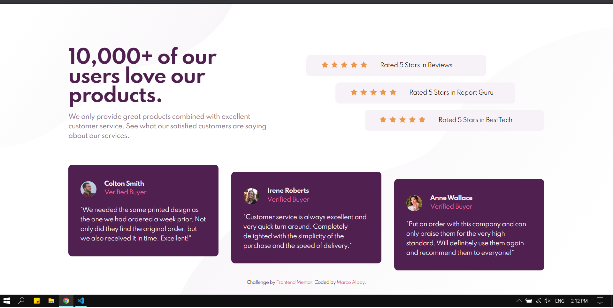
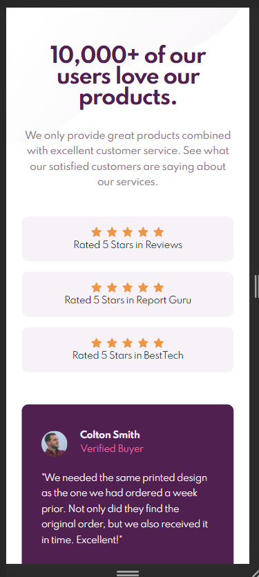
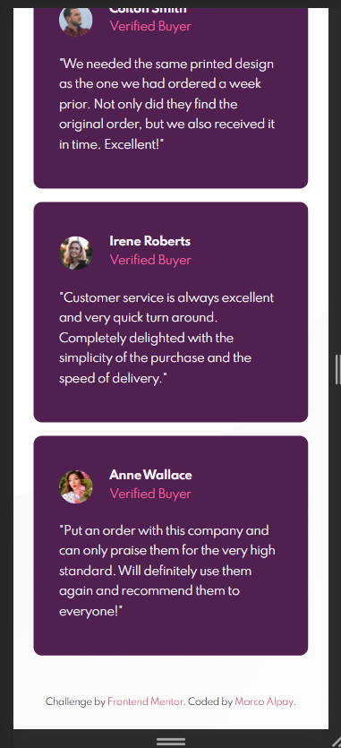

# Frontend Mentor - Social proof section solution

This is a solution to the [Social proof section challenge on Frontend Mentor](https://www.frontendmentor.io/challenges/social-proof-section-6e0qTv_bA). Frontend Mentor challenges help you improve your coding skills by building realistic projects.

## Table of contents

- [Overview](#overview)
  - [The challenge](#the-challenge)
  - [Screenshot](#screenshot)
  - [Links](#links)
- [My process](#my-process)
  - [Built with](#built-with)
  - [What I learned](#what-i-learned)
- [Author](#author)

## Overview

### The challenge

Users should be able to:

- View the optimal layout for the section depending on their device's screen size

### Screenshot





### Links

- Solution URL: [Add live site URL here](https://your-live-site-url.com)
- Live Site URL: [https://devmarco02-social-proof.netlify.app/](https://devmarco02-social-proof.netlify.app/)

## My process

### Built with

- Semantic HTML5 markup
- Sass
- Flexbox
- CSS Grid
- Mobile-first workflow

### What I learned

I have learned how to control the size of columns/rows.

```css
.main-container {
  min-height: 100vh;
  display: grid;
  grid-template-columns: 1fr 1fr;
  grid-template-rows: auto 1fr auto;
  place-items: center;
}
```

## Author

- Frontend Mentor - [@devMarco02](https://www.frontendmentor.io/profile/devMarco02)
